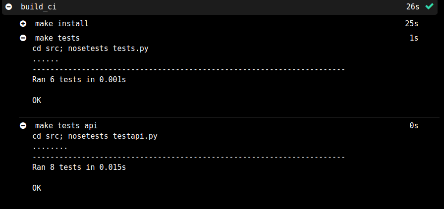

## Índice

* Herramientas de construcción y prueba
  * [Test unitarios](#tests)
  * [Tests de integración](#testsapi)

* Integración contínua
  * [Travis CI](#travis)
  * [shippable](#shi)

## Herramientas de construcción y prueba
  
### Tests Unitarios
Para testear la clase Clientes, se ha usado nosetest.

Ejecución de tests unitarios:
>  make test

Se testean todos los métodos de la clase y además del método para comprobar si se ha inicializado bien.
- **testBusquedaPorNombre**: Se testea que no se haya introducido un número, busqueda vacía y que exista ese nombre.
- **testBusquedaPorDNI**: Se testea que no se haya introducido una busqueda vacía y que exista ese DNI.
- **testBusquedaPorProvincia**:  Se comprueba que no se haya introducido un número, busqueda vacía y que exista la provincia que se introduzca.
- **testBusquedaPorEstado**: se comprueba que el estado que se haya introducido sea uno de los dos posibles (alta o baja), que no se introduzca un número, ni una búsqueda vacía.
- **testRobinson**: testea cuando un cliente introducido sea robinson devuelva el mensaje "No puede ofrecer ofertas a este cliente"

- [Enlace al archivo de tests unitarios](https://github.com/patriciamaldonado/GestEnergy/blob/master/src/tests.py)

  
### Tests de integración
Para los tests de integración se ha testeado la api.

Ejecución de tests de integración:
>  make tests_api
- [Enlace al archivo de la api](https://github.com/patriciamaldonado/GestEnergy/blob/master/src/main.py)

Es fundamental comprobar:
 - que el estado que se ha devuelto sea el correcto (status = OK)
 - el código devuelto sea 200
 - y además que el contenido devuelto sea el correcto, en este caso que se devuelva contenido JSON.

Sin olvidarnos de comprobar si la URL introducida es correcta (error 404), esto se ha controlado desde la misma api.

- [Enlace al archivo de tests de integración ](https://github.com/patriciamaldonado/GestEnergy/blob/master/src/testapi.py)

## Integración continua

Para integración continua se va a usar Travis CI,éste clona el repositorio a un entorno virtual para construir y probar tu código. Además como CI adicional se usará Shippable.
Es fundamental detectar todos los fallos para posteriormente desplegar una versión correcta.
Con Travis se va a probar el servicio, iniciarlo, reiniciarlo, pararlo... y con Shippable se van a ejecutar los tests unitarios y test de integración.

### Configuración Travis CI para Python

1. Para empezar hay que ingresar con nuestra cuenta de Github en [Travis](https://travis-ci.com/) y permitir el acceso al repositorio del proyecto.
2. Añadir un archivo .travis.yml en la raíz de nuestro repositorio, en este archivo se incluye el lenguaje, las versiones de python a probar,instalar librerias, ejecución de test...

      - Podemos añadir comandos para que se ejecuten antes de la instalación (before_install).Instalar la útima versión de pip                  (pip install -U pip),comprobar versión en la que se está ejecutando con (python --version)                     
      - Con respecto a las versiones elegidas para probar nuestro código en python, no es recomendable usar inferiores a la 3.X   ya que la versión 2.7 no podrá utlizarse a partir de 2020. Por este motivo se probará en las versiones 3.X.
      Se ha probado la versión 3.7  y la versión 3.7-dev, ya que estsa versiones son recientes y no han llegado a su end-of-life.
      -  Las dependencias que necesitamos para nuestro proyecto se definen en en archivo requirements.txt, actualmente solo contiene la versión de flask y versión de gunicorn.
      - La herramienta de construcción utlizada es Makefile con la que podremos instalar lo necesario ejecutando el comando make install.
      - Además Travis se encargará de iniciar el servicio, pararlo, reiniciarlo..etc.
          - make start
          - make stop
          - make restart
          - make show
          - make delete

3. Una vez que tengamos configurado nuestro archivo .travis.yml correctamente, cada vez que hagamos git push se verificará si ha ido todo correctamente.

    - [Archivo de travis](https://github.com/patriciamaldonado/GestEnergy/blob/master/.travis.yml)
    - [Requirements](https://github.com/patriciamaldonado/GestEnergy/blob/master/requirements.txt)
    - [Makefile](https://github.com/patriciamaldonado/GestEnergy/blob/master/Makefile)

### Configuración shippable para Python
  Como CI extra se ha elegido shippable.
  Para configurar shippable tenemos que ingresar en la página [shippable](https://app.shippable.com) y permitir acceso a nuestra cuenta de Github.
  Creamos un archivo llamado .shippable.yml en el que añadimos el lenguaje, versiones del lenguaje a probar,instalación de dependecias y los comandos necesarios para la ejecución de test.
  - Para la ejecución de los tests ejecutamos make tests y make testapi se situa en la carpeta contenedora del test y lo testea mediante nosetest.

  [Archivo de shippable](https://github.com/patriciamaldonado/GestEnergy/blob/master/.shippable.yml)

 Podemos comprobar que los test se han ejecutado correctamente.
   
   
