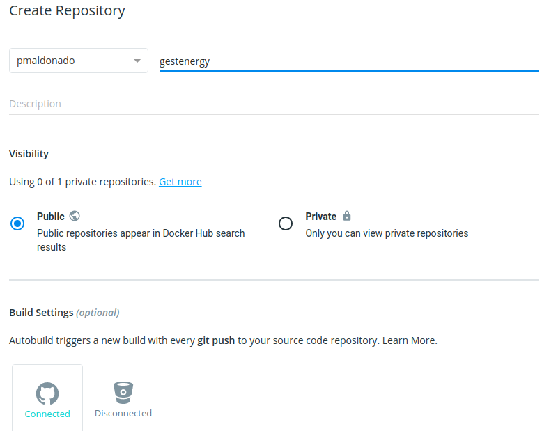
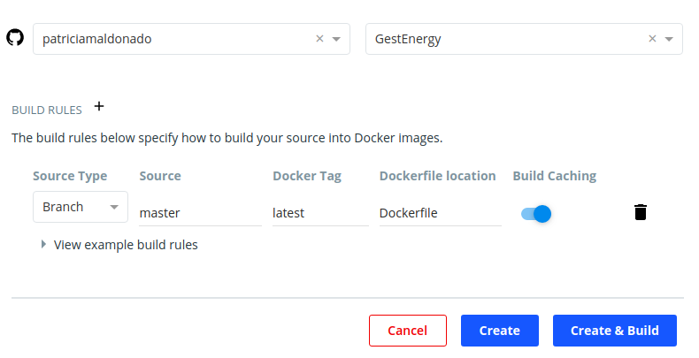
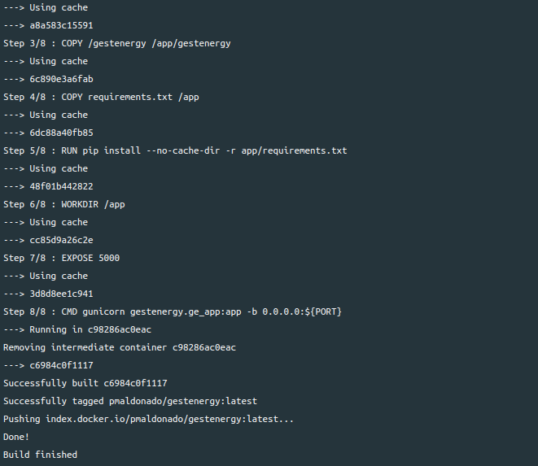
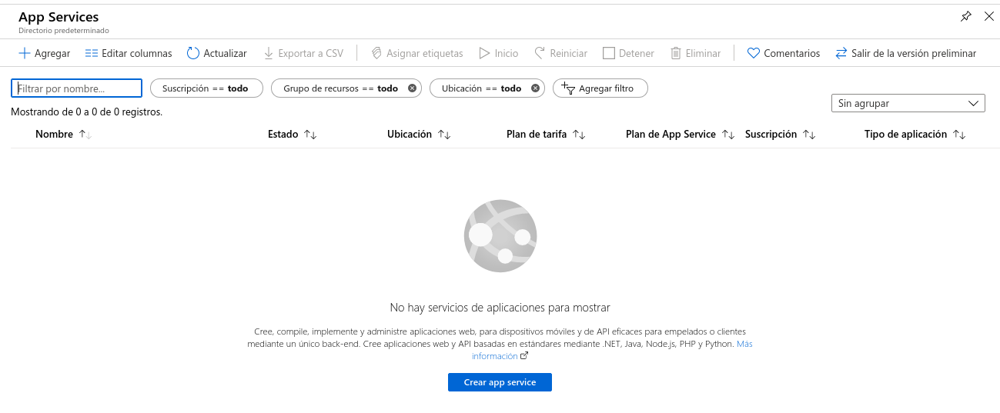
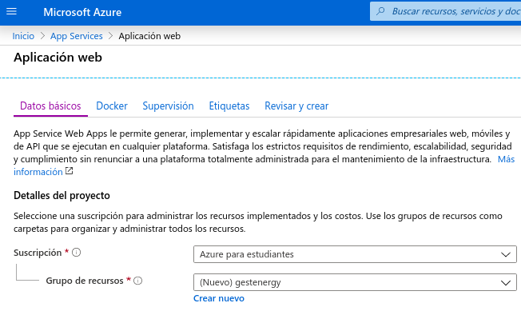
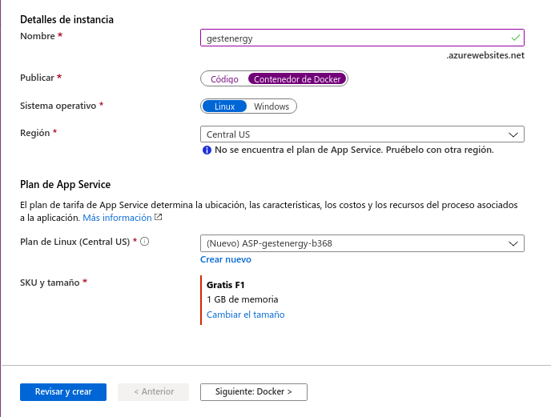
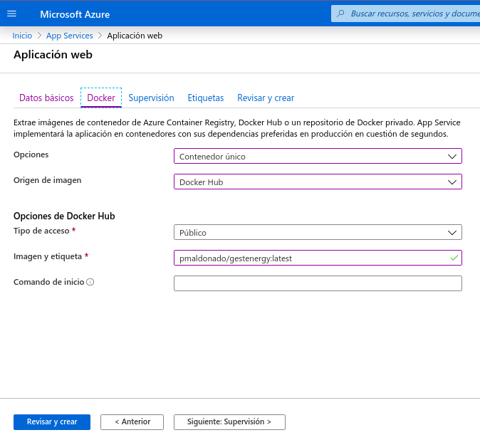
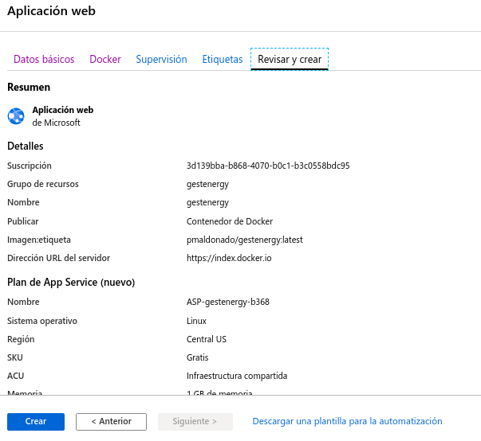

# Despliegue en un Contenedor (Docker)
Con Docker podemos crear contenedores para que nuestra aplicación se pueda ejecutar en cualquier máquina independientemente del sistema operativo.

   * [Dockerfile](#Dockerfile)
   * [Dockerhub](#Dockerhub)
   * [Despliegue en Heroku](#DespliegueHeroku)
   * [Despliegue en Azure](#DespliegueAzure)


<a name="Dockerfile"></a>

## Dockerfile

Este archivo tendrá las instrucciones necesarias para crear nuestra imagen.
- **Para empezar tenemos que instalar Docker [[1]](#instadocker)**
- **Creamos en la raíz de nuestro repositorio el archivo Dockerfile [[2]](#rdockerfile) [[3]](#rdockerfile2)**

  ```

  FROM  python:3.7-slim-buster

  LABEL maintainer="patriimaldonado@gmail.com"

  COPY /gestenergy /app/gestenergy

  COPY requirements.txt /app

  RUN pip install --no-cache-dir -r app/requirements.txt

  WORKDIR /app

  EXPOSE 5000

  CMD gunicorn gestenergy.ge_app:app -b 0.0.0.0:${PORT}

  ```

- **Especificamos la imagen base, es recomendable usar una imagen ligera [[4]](#imagenligera)**

  ```FROM  python:3.7-slim-buster```

    Se ha elegido la imagen **python:3.7-slim-buster** que  tiene 60 MB cuando se descarga, 179 MB cuando se descomprime en disco, al final mi imagen con los archivos necesarios tiene un tamaño de 188MB.

    

- **Podemos establecer datos del propietario del archivo.**

  ```
  LABEL maintainer="patriimaldonado@gmail.com"
  ```

- **Copiamos solo los archivos necesarios para el despliegue.**
   La carpeta que contiene la aplicación, la clase y los datos JSON, además del archivo requirements con sus dependencias para su instalación.

  ```
  COPY /gestenergy /app/gestenergy
  COPY requirements.txt /app
  ```

- **Con el comando RUN instalamos las dependencias**

  ```
  RUN pip install --no-cache-dir -r app/requirements.txt
  ```

- **Establecemos el directorio de trabajo**
  ```
   WORKDIR /app
  ```

- **Este comando expone el puerto al exterior aunque es informativo.**

    ```
    EXPOSE 5000

    ```

- **Ejecutamos el comando para lanzar la aplicación.** Especificando la variable $PORT que usará heroku para establecer un puerto.[[6]](#puertoheroku)

    ```
  CMD gunicorn gestenergy.ge_app:app -b 0.0.0.0:${PORT}
    ```

  - [Enlace Archivo Dockerfile](https://github.com/patriciamaldonado/GestEnergy/blob/master/Dockerfile)

### Prueba en local

Ya tenemos el archivo Dockefile, vamos a probarlo en local. [[9]](#noroot) [[10]](#pruebalocal)

  - **Construimos nuestra imagen Docker**
    ```
    docker build -t gestenergy .
    ```

  - **Podemos ver la imagen con el siguiente comando.**

    ```
    docker images
    ```

  - **Ejecutamos el contendor pasándole el puerto.**
    Se ejecutará en localhost con el puerto 5000.
    (Para la prueba en local, en el comando CMD he cambiado $PORT por el puerto 5000)
     ```
    docker run -p 5000:5000 gestenergy
     ```
      

     Y comprobamos desde la URL http://0.0.0.0:5000/ que funciona correctamente, además mediante el comando ```docker ps``` vemos que está en ejecución.

<a name="Dockerhub"></a>

## Dockerhub

Una vez que ya hemos comprobado que la imagen Docker construida funciona, podemos subirla a Dockerhub para posteriormente poder desplegarla en la plataforma deseada.

Para subir nuestra imagen Docker a Dockerhub:

**1. Creamos una cuenta en [Dockerhub](https://hub.docker.com/)**

**2. Creamos un repositorio que linkearemos con nuestro repositorio de Github. [[8]](#dockerhub)**
 Si lo creamos mediante create and build automáticamente cogerá nuestro Dockerfile del repositorio y creará la imagen.

   
   

Vemos como se ha publicado correctamente nuestra imagen Docker.

   
   

- [Enlace a la imagen en Dockerhub](https://hub.docker.com/r/pmaldonado/gestenergy)


<a name="DespliegueAzure"></a>
## Despliegue en heroku

**1. Nos logueamos en heroku, y en el registro de contenedores**

 ```
  heroku login

  heroku container:login
 ```

**2. Creamos una aplicación en heroku (gestenergy-docker)**

  ```
  heroku create gestenergy-docker
  ```

**3. Vamos a usar la imagen de que hemos subido a Dockerhub.**

Descargamos la imagen con el siguiente comando:

  ```
    docker pull pmaldonado/gestenergy
 ```

**4.  Nuestra imagen de Dockerhub la etiquetamos para subir a Heroku.**

  ```
  docker tag <image> registry.heroku.com/<app>/<process-type>

  docker tag pmaldonado/gestenergy registry.heroku.com/gestenergy-docker/web

  ```
  **5. Y por último la subimos al registro de heroku [[5]](#dockerheroku).**

  ```
  docker push registry.heroku.com/<app>/<process-type>

  > docker push registry.heroku.com/gestenergy-docker/web

  heroku container:release --app app-name web

  > heroku container:release --app gestenergy-docker  web
   ```
  

En la siguiente URL se encuentra nuestra aplicación desplegada:

  > https://gestenergy-docker.herokuapp.com/


## Heroku.yml

  Otra opción es crear un archivo llamado Heroku.yml para automatizar el proceso de creación del contenedor, para ello crearemos un archivo llamado Heroku.yml [[7]](#herokuyml2) en la raíz de nuestro repositorio.

  - **A continuación vemos el contenido del archivo Heroku.yml. Le decimos a Heroku el Dockerfile que usará para construir la imagen. Ejecutará el comando CMD de nuestro Dockerfile.**  ```CMD gunicorn gestenergy.ge_app:app -b 0.0.0.0:${PORT}```

     ```
        build:

          docker:

            web: Dockerfile
     ```


  - **Configuramos la imagen como contenedor**

    ```
    heroku stack:set container

    ```

  - **Y por último hacemos push hacia Heroku para para construir la imagen y ejecutar el contenedor **

    ```
    git push heroku master

    ```
  <a name="DespliegueHeroku"></a>

## Despliegue en Azure

 El despliegue de nuestra aplicación en Azure también lo vamos a hacer mediante la imagen que tenemos almacenada en Docker Hub.

  - **Una vez tengamos la cuenta creada de [Azure](https://portal.azure.com/#home).**

  - **Nos dirigimos a **APP Services** y creamos una nueva aplicación.**

  


- **En esta sección rellenamos los datos requeridos e indicamos que vamos a publicar como Contenedor Docker.**

  
  

- **Para especificar la imagen Docker Hub que vamos a utilizar nos situamos en la pestaña Docker.**

  
- **Una vez hecho esto ya estará todo configurado para subirla, pulsamos Revisar y Crear, y después a Crear.**

  

- **Comprobamos que efectivamente esta funcionando correctamente en la dirección que le hemos indicado anteriormente.**

  > https://gestenergy.azurewebsites.net/


## Referencias

- <a name="instadocker"> [[1] Instalación Docker](https://www.digitalocean.com/community/tutorials/how-to-install-and-use-docker-on-ubuntu-16-04)</a>

- <a name="rdockerfile">[[2] Crear Dockerfile](https://www.wintellect.com/containerize-python-app-5-minutes/)

- <a name="rdockerfile2">[[3] Comandos Dockerfile](https://docs.docker.com/engine/reference/builder/)

- <a name="imagenligera">[[4] Imagen ligera Dockerfile](https://pythonspeed.com/articles/base-image-python-docker-images/)

 - <a name="dockerheroku"> [[5] Docker Heroku](https://devcenter.heroku.com/articles/container-registry-and-runtime#cli)</a>

 - <a name="puertoheroku"> [[6] Puerto Heroku](https://stackoverflow.com/questions/42162833/how-can-i-expose-the-dynamic-port-from-heroku-in-a-dockerfile)</a>

 - <a name="herokuyml2"> [[7] Heroku.yml](https://devcenter.heroku.com/articles/build-docker-images-heroku-yml)</a>

 - <a name="dockerhub"> [[8] Docker Hub](https://docs.docker.com/docker-hub/)</a>

 - <a name="noroot"> [[9] Docker como usuario no root](https://docs.docker.com/install/linux/linux-postinstall/)</a>

 - <a name="dockerlocal"> [[10] Docker instalacion y primeros pasos ](https://www.ionos.es/digitalguide/servidores/configuracion/tutorial-docker-instalacion-y-primeros-pasos/)</a>
