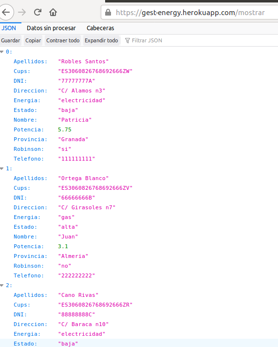
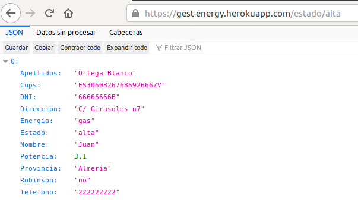
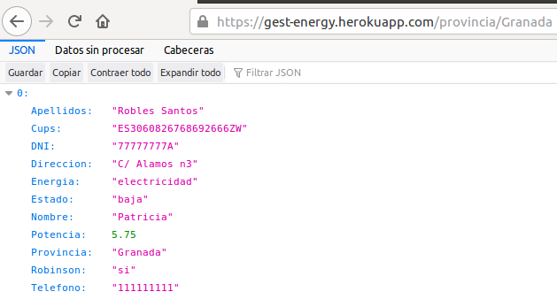
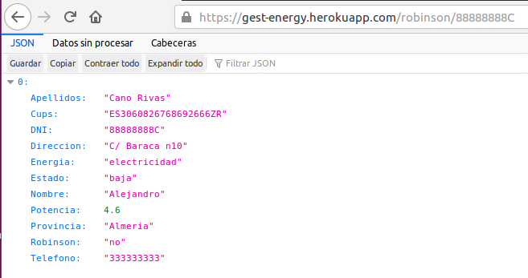
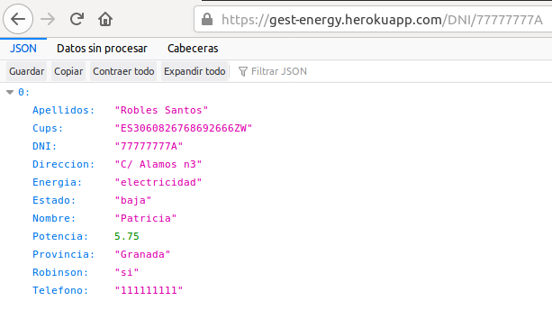
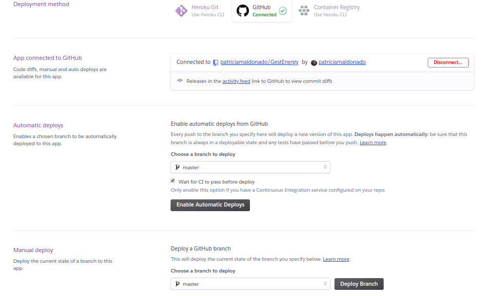

# Despliegue  en un PaaS

* #### **Despliegue en heroku**
    * [Creación Procfile](#procfile)
    * [Alta en Heroku y despliegue](#altaHeroku)
    * [Despliegue atomático Github](#des_github)

## Instalación,configuración y despliegue en Heroku
Como método de despliegue principal en un PaaS se ha elegido Heroku.

### Creación Procfile
Para el despliegue en heroku, tenemos que crear un archivo llamado **Procfile** en la raíz
de nuestro repositorio. En este archivo incluimos los comandos para iniciar nuestra aplicación,en este caso le pasamos:
> web: make start-heroku.

Significa que vamos a desplegar una aplicación web con la herramienta de construcción Makefile en la que hemos definido el target **start-heroku**.

 En el makefile, start-heroku ejecuta el comando siguiente para iniciarla:
> gunicorn src.main:app -b 0000:$(PORT)

- [Archivo Procfile](https://github.com/patriciamaldonado/GestEnergy/blob/master/Procfile)

### Alta en Heroku y despliegue
**1. Para empezar tenemos que creamos una cuenta en Heroku [Alta Heroku](https://signup.heroku.com/login)**

**2. Instalamos [Heroku CLI](https://devcenter.heroku.com/articles/heroku-cli#download-and-install)**

  > sudo snap install heroku --classic

**3. Login en heroku**

  > heroku login

**4. Creamos la aplicación.**

> heroku create gest-energy --buildpack heroku/python

  - Se le ha asignado el nombre y el buildpack de python.

      

- Heroku create automáticamente agrega un remote de Heroku a nuestro repositorio de aplicaciones.

 

**5. Despliegue.**
Por último hacemos push para desplegar nuestra aplicación.

> git push heroku master

**5. Comprobamos que se ha desplegado correctamente en la siguiente URL.**

> https://gest-energy.herokuapp.com/

Podemos probar los siguientes ejemplos de rutas y verificar que funcionan correctamente y que se ha realizado el despliegue.
En caso de error, podemos ejecutar el comando [**heroku logs**](https://devcenter.heroku.com/articles/logging) e investigar el motivo que ha causado el error en el despliegue.

- **/**
> https://gest-energy.herokuapp.com/

  

- **/status**
> https://gest-energy.herokuapp.com/status

    

- **/mostrar**
> https://gest-energy.herokuapp.com/mostrar

   

- **/estado/alta**
> https://gest-energy.herokuapp.com/estado/alta

    

- **/provincia/Granada**
> https://gest-energy.herokuapp.com/provincia/Granada

    

- **/robinson/88888888C**

>https://gest-energy.herokuapp.com/robinson/88888888C

   

- **/DNI/77777777A**

>https://gest-energy.herokuapp.com/DNI/77777777A

  

### Despliegue automático Github
Podemos habilitar la opción para que nuestra aplicación se despliegue automáticamente cada vez que hacemos push. Para ello tenemos que dirigirnos a la web de [heroku](https://dashboard.heroku.com/apps) dentro de nuestra aplicación y en la sección de deploy habilitamos automatic deploys. Además de marcar **Wait for CI to pass before deploy**
para que se despliegue una vez pasados los test de nuestro CI.

  
